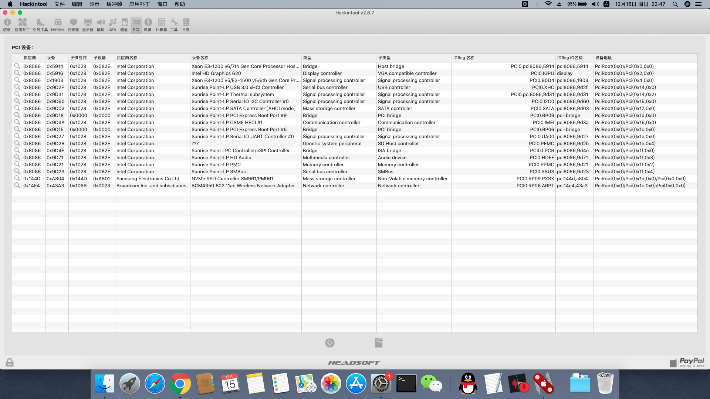

# Dell Vostro 5370

## Device

change intel wifi to Broadcom BCM94350ZAE（DW1820A）
change SSD to Sansung PM961

CPU： Intel i5-8250u
GPU： UHD 620
OS ： Mac Mojave 10.14.5

触摸板正常，电池管理基本正常。注意由于触摸板没有压感，不能像苹果触摸板那样按压拖动，其他手势正常。

HDMI 接口和 type-c 未测试是否可用

驱动位于 EFI/CLOVER/kexts/Other 中，部分驱动没有用到，可以按需删除，可以参考 Hackintool 查看哪些驱动被加载。

UHD 620显卡 和 DW1820A网卡驱动方式请参考黑果小兵相关教程。

截图位于image目录。

镜像来自黑果小兵，感谢。
感谢各位开源社区贡献者。
